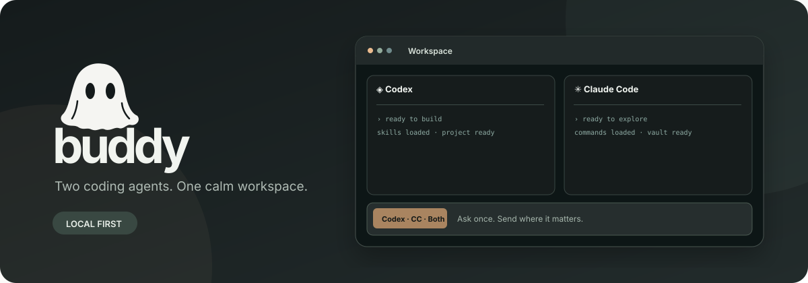

<div align="center">
  

  # Buddy

  **Two coding agents. One calm workspace.**

  [](LICENSE)
  [](#install-on-macos)
  [](#requirements)
  [](#choose-your-vault)
</div>

Buddy brings the real **Codex** and **Claude Code** CLIs into two interactive panes with one shared prompt composer. Send a prompt to either agent or both. Browse installed skills and commands, improve selected prompt text with AI, and choose a model and effort level for each agent.

Buddy runs on your Mac. It opens at `http://127.0.0.1:4317/`, with a Dock icon and a menu bar control. The local server starts when you log in, so you install once and then just click Buddy or open the URL.

## Install on macOS

### Requirements

- macOS 13 or newer
- Node.js 20 or newer, Git, and Apple Command Line Tools (`xcode-select --install`)
- [Codex CLI](https://github.com/openai/codex) and [Claude Code](https://docs.anthropic.com/en/docs/claude-code/overview), installed and signed in separately

```bash
git clone https://github.com/Dethjunky1974/buddy-app.git
cd buddy-app
zsh scripts/install-macos.sh
```

The installer puts `Buddy.app` in `~/Applications`, pins it after Chrome in the Dock when Chrome is present, and registers a local login service. It does not install or sign in to either AI CLI. To update Buddy, run `git pull` in the checkout and rerun the installer. You can also use `npm install && npm start` for development without installing the app.

On first launch, choose the folder both CLIs should work in and respond to their normal folder-trust prompts. Buddy remembers your workspace, vault choice, and each agent's model settings on that Mac.

## Choose your vault

Open **Set up** in the left sidebar. A vault is optional, and you can name it anything you like.

| Mode | What Buddy does | Good for |
| --- | --- | --- |
| **No vault** | Saves session records on this Mac under `~/Library/Application Support/Buddy/data/` | Trying Buddy or working without Obsidian |
| **Local vault** | Reads `Projects/<project>/hot.md` and `index.md`; saves sessions under `Tooling/Buddy/` in your chosen folder | One Mac, or a vault synced by your own method |
| **GitHub vault** | Uses an existing GitHub checkout, or clones a repository into a new folder. Pulls before reading, commits Buddy's own session files, and pushes after saving | The same vault on multiple Macs |

For GitHub mode, create a **private repository with an initial commit** first and sign in to Git on each Mac. Paste its URL into Buddy if it needs to clone a new folder; for an existing checkout, its `origin` remote is enough. Use a separate checkout on each Mac and choose GitHub mode on both. Buddy refuses to overwrite dirty or diverged Git state. When a save cannot safely publish, it queues the record locally for retry.

Buddy never needs your vault to run the CLIs. With a vault connected, selecting a project adds its current `hot.md` and `index.md` to the prompt. Session records include the prompt and a short terminal excerpt; keep sensitive text out of the composer if you do not want it recorded in your vault.

## What is inside

- **One composer, three destinations:** Codex, Claude Code, or both.
- **Real interactive terminals:** native CLI prompts, permissions, and keyboard controls remain available.
- **Command library:** scans installed Codex and Claude Code skills, plugins, and project commands; choose an invocation before sending.
- **Prompt improvement:** highlight text, improve it with Codex or Claude Code, then review the rewrite before accepting.
- **Independent models:** set a model ID and reasoning effort per pane. Changing either starts a new CLI session.
- **Optional Obsidian context:** use your own named vault locally or across Macs through GitHub.

Buddy listens only on `127.0.0.1` and uses your existing CLI logins. It stores vault settings locally in `~/Library/Application Support/Buddy/settings.json`; it does not store GitHub or AI API tokens. The app's terminal sessions can still access the files permitted to your signed-in CLIs, so review their normal trust prompts.

## Contributing

Issues and focused pull requests are welcome. Start with [CONTRIBUTING.md](CONTRIBUTING.md). The project is released under the [MIT License](LICENSE).
